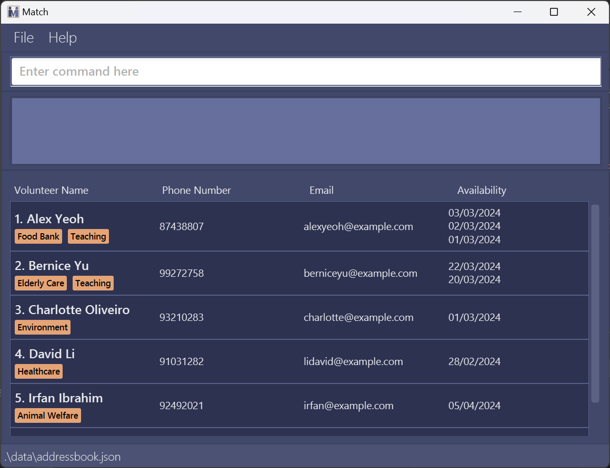
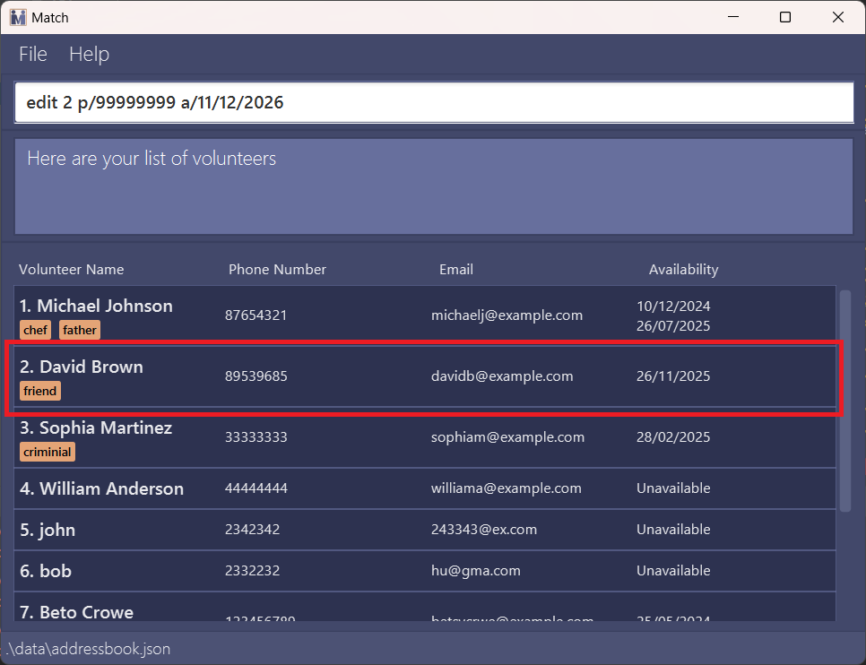
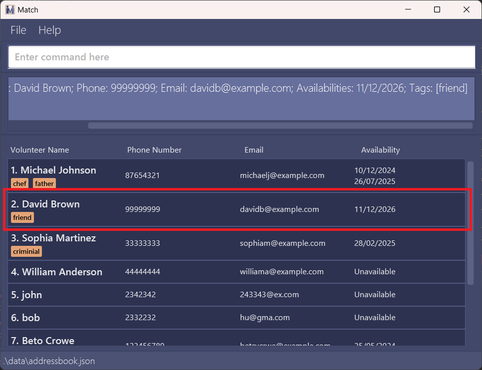
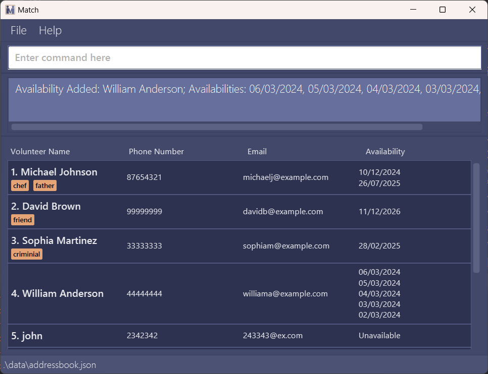
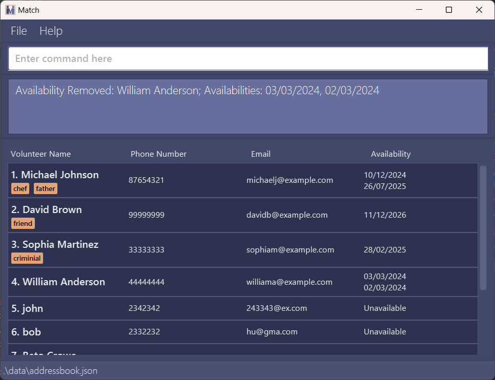
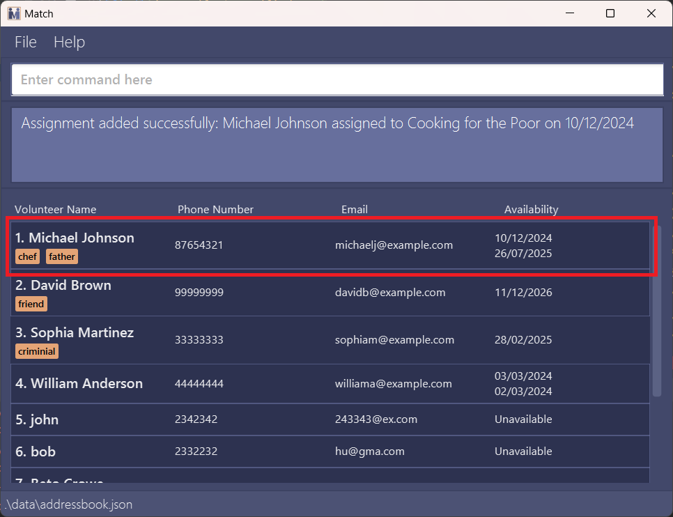
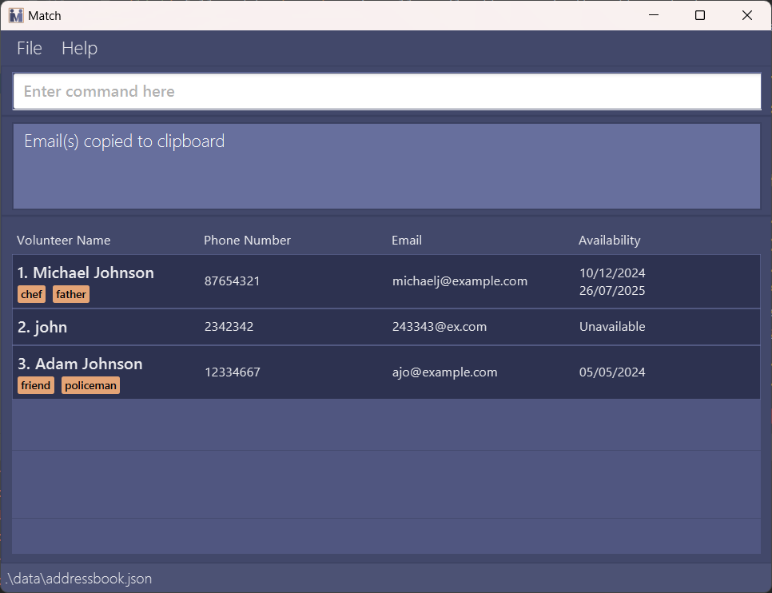

 

 

Match is a **desktop app for volunteer coordinators** to keep track of volunteer contacts as well as assign volunteering assignments to them.

We are **optimized for use via a Command Line Interface** (CLI) while still having the benefits of a Graphical User Interface (GUI). 

If you can type fast, Match can get your contact management tasks done faster than traditional GUI apps.

- Table of Contents
  {:toc}

---

## Quick start

1. Ensure you have Java `11` or above installed in your Computer.

1. Download our latest `match.jar` from [here](https://github.com/AY2324S2-CS2103T-F10-4/tp/releases).

1. Copy the file to the folder you want to use as the _home folder_ for your Match.

1. Open a command terminal, `cd` into the folder you put the jar file in, and use the `java -jar match.jar` command to run the application. 
   A GUI similar to the below should appear in a few seconds. Note how the app contains some sample data. 
   

1. Type the command in the command box and press Enter to execute it. e.g. typing **`help`** and pressing Enter will open the help window. 
   Some example commands you can try:

   - `list` : Lists all contacts.

   - `add n/John Doe p/98765432 e/johnd@example.com a/25/05/2025` : Adds a contact named `John Doe` to the Address Book.

   - `delete 3` : Deletes the 3rd contact shown in the current list.

   - `clear` : Delete all contacts.

   - `exit` : Exits the app.

1. Refer to the [Features](#features) below for details of each command.

---

## Features

**:information_source: Notes about the command format:** 

- Words in `UPPER_CASE` are the parameters to be supplied by the user. 
  e.g. in `add n/NAME`, `NAME` is a parameter which can be used as `add n/John Doe`.

- Command are case-sensitive and are to be  in `lower_case`.  
  e.g. in `add n/NAME`, `add` is a command which should be in lower-case.

- Items in square brackets are optional. 
  e.g `n/NAME [t/TAG]` can be used as `n/John Doe t/friend` or as `n/John Doe`.

- Items with `…`​ after them can be used multiple times including zero times. 
  e.g. `[t/TAG]…​` can be used as ` ` (i.e. 0 times), `t/friend`, `t/friend t/family` etc.

- Parameters can be in any order. 
  e.g. if the command specifies `n/NAME p/PHONE_NUMBER`, `p/PHONE_NUMBER n/NAME` is also acceptable.

- Extraneous parameters for commands that do not take in parameters (such as `help`, `list`, `exit` and `clear`) will be ignored. 
  e.g. if the command specifies `help 123`, it will be interpreted as `help`.

* If you are using a PDF version of this document, be careful when copying and pasting commands that span multiple lines as space characters surrounding line-breaks may be omitted when copied over to the application.

### Adding a person: `add`

Adds a person to the address book.

Format: `add n/NAME p/PHONE_NUMBER e/EMAIL [a/AVAILABILITY] [t/TAG]…​`

:bulb: **Tip:**

A person can have any number of tags and any number of availabilities (including 0)

**:information_source: Take note:** 

You can use tags of any length, but tags that are longer than 25 characters will be truncated when they are shown.

Examples:

- `add n/John Doe p/98765432 e/johnd@example.com a/22/05/2024`
- `add n/Betsy Crowe t/friend e/betsycrowe@example.com a/25/05/2024 p/1234567 t/criminal`

What you should see:

### Editing a person : `edit`

Edits an existing person in the address book.

Format: `edit INDEX [n/NAME] [p/PHONE] [e/EMAIL] [a/AVAILABILITY] [t/TAG]…​`

- Edits the person at the specified `INDEX`. The index refers to the index number shown in the displayed person list. The index **must be a positive integer** 1, 2, 3, …​
- At least one of the optional fields must be provided.
- Existing values will be updated to the input values.
- When editing tags, the existing tags of the person will be removed i.e adding of tags is not cumulative.
- You can remove all the person’s tags by typing `t/` without
  specifying any tags after it.

Examples:

- `edit 1 p/91234567 e/johndoe@example.com` Edits the phone number and email address of the 1st person to be `91234567` and `johndoe@example.com` respectively.
- `edit 2 n/Betsy Crower t/` Edits the name of the 2nd person to be `Betsy Crower` and clears all existing tags.

What you should see:

### Adding availabilities : `addavail`

Adds availabilities to the address book.

Format: `addavail INDEX a/AVAILABILITY`

- Adds to person at the specified `INDEX`. The index refers to the index number shown in the displayed person list. The index **must be a positive integer** 1, 2, 3, …​
- Availability must be in the format of DD/MM/YYYY eg: 28/03/2024
- Availability must be not be present at the index in order to add.

Examples:

- `addavail 1 a/01/01/2024`
- `addavail 2 a/02/03/2024 a/03/03/2024`

What you should see:

### Removing availabilities : `removeavail`

Removes availabilities from the address book.

Format: `removeavail INDEX a/AVAILABILITY`

- Removes from person at the specified `INDEX`. The index refers to the index number shown in the displayed person list. The index **must be a positive integer** 1, 2, 3, …​
- Availability must be in the format of DD/MM/YYYY eg: 28/03/2024
- Availability must be present at the index in order to remove.

Examples:

- `removeavail 1 a/01/01/2024`
- `removeavail 2 a/02/03/2024 a/03/03/2024`

:exclamation: **Caution:**
In this version of Match, removing an availability will not delete assignments tagged to that deleted availability.
This is mainly for record-keeping purposes.

What you should see:

### Listing all persons : `list`

Shows a list of all persons in the address book.

Format: `list`

What you should see:

### Locating persons by name: `find`

Find people whose names contain any of the given name or availability.

Format: `find [n/NAME] [a/AVAILABILITY] [MORE_KEYWORDS]`

- The search is case-insensitive. e.g `hans` will match `Hans`
- The order of the keywords does not matter. e.g. `Hans Bo` will match `Bo Hans`
- Partial words will be matched e.g. `Han` will match `Hans`
- Persons matching at least one keyword will be returned (i.e. `OR` search).
  e.g. `Hans Bo` will return `Hans Gruber`, `Bo Yang`
- `[MORE_KEYWORDS]` refers to more `[n/NAME]` or `[a/AVAILABILITY]`

Examples:

- `find n/John` returns `john`, `John`, `John Doe` and so on...
- `find n/alex david` returns `Alex Yeoh`, `David Li` 
- `find n/alex n/david` returns `Alex Yeoh`, `David Li`
- `find a/23/05/2024` returns people who are available on 23/05/2024
- `find a/23/05/2024 a/24/05/2024` returns people who are available on either 23/05/2024 or 24/05/2024

What you should see:

### Deleting a person : `delete`

Deletes the specified person from the address book.

Format: `delete INDEX`

**:information_source: Take note:** 

- As delete is deemed as a critical operation, you will see a confirmation message.

- Do not panic, entering `y` following it will delete proceed to delete the specified entry, while entering anything else will default to cancelling the operation.

- Deletes the person at the specified `INDEX`.
- The index refers to the index number shown in the displayed person list.
- The index **must be a positive integer** 1, 2, 3, …​

Examples:

- `list` followed by `delete 2` deletes the 2nd person in the address book.
- `find Betsy` followed by `delete 1` deletes the 1st person in the results of the `find` command.

:exclamation: **Caution:**
In this version of Match, deleting a person will not delete his/her assignments.

### Clearing all entries : `clear`

Clears all entries from the address book.

Format: `clear`

**:information_source: Take note:** 

- As clear is deemed as a critical operation, you will see a confirmation message.

- Do not panic, entering `y` following it will delete proceed to delete the specified entry, while entering anything else will default to cancelling the operation.

### Assigning volunteers : `assign`

Adds an assignment to the address book.

Format: `assign INDEX d/ASSIGNMENTDETAILS a/AVAILABILITY`

- Assigns the person at the specified `INDEX`. The index refers to the index number shown in the displayed person list. The index **must be a positive integer** 1, 2, 3, …​
- Availability must be in the format of DD/MM/YYYY eg: `28/03/2024`
- The person at the specified `INDEX` must be available on the `AVAILABILITY` entered.
- Each person can only be assigned 1 volunteer activity per day.
- `ASSIGNMENTDETAILS` must be alpha-numeric and cannot be empty. eg: `Willing Hearts`

:bulb: **Tip:**
The index here works the same way as Edit!

Examples:

- `assign 1 d/Tutoring a/01/01/2024`
- `assign 2 d/Elderly Care a/02/03/2024`

What you should see:

### Listing all assignments : `lista`

Shows a list of all assignments in the address book.

:bulb: **Tip:**
To switch back to volunteer list, type `list`

What you should see: [here](UserGuide.md/#assigning-volunteers--assign)

### Remove assignments : `removeassign`

Removes an assignment from the assignment list.
Format: `removeassign INDEX`

- Removes the assignment at that `INDEX`. The index refers to the index number shown in the displayed assignment list. The index **must be a positive integer** 1, 2, 3, …​

Examples:
`removeassign 1`
`removeassign 2`

### Refreshing availabilities : `refresh`

Remove outdated availabilities based on current date from address book.

Format: `refresh`

### Copying emails : `copy`

Copies the email addresses of all people in the currently filtered list to the clipboard.

**Notes about the command:** 

- This command cannot be used when the assignment list is being displayed. Switch back to the volunteer list by using the `list` command before using `copy`.

- The email addresses will be copied in a comma-separated format, e.g. `john@example.com, jane@example.com, ...`.

- If there are no people in the filtered list, an error message will be shown.

Format: `copy`

Examples:

- `list` followed by `copy` copies all email addresses in the address book.
- `find n/john` followed by `copy` copies the email addresses of people whose names contain "john".

What you should see:

### Exporting to CSV: `export`

Exports data to a comma-separated values (CSV) file located at `[JAR file location]/data`. Both persons and assignments are exported as `persons.csv` and `assignments.csv` respectively.

**:information_source: Notes about `export` command:** 

- When using the application for the first time, executing the `export` command when the `addressbook.json` is missing will result in an error. Try executing other commands first. This will result `addressbook.json` file to be created.
- When the `persons.csv` or `assignments.csv` files are being used by another application running `export` command will result in an error.

### Viewing help : `help`

Shows a message explaning how to access the help page.

Format: `help`

### Exiting the program : `exit`

Exits the program.

Format: `exit`

### Accessing the command history

To access the command history:

- From the input field, press the down arrow key (↓) to bring out the drop-down menu of previous commands.
- Use the up (↑) and down (↓) arrow keys to navigate through the command history.

**:information_source: Note** 
- After you enter a command, the command history will automatically close. If you wish to close the command history manually, you have two options:
  1. Press the `Ctrl` key on your keyboard.
  2. Click anywhere outside of the command history dropdown.
- Long input commands will be truncated when viewed in the command history. This has no effect on the functioning of the command history or the execution of previous commands.

### Using the autocomplete

Autocomplete provides suggestions based on your command history as you type. You can navigate through the suggestions using the arrow keys, similar to the command history.

### Saving the data

Match data are saved in the hard disk automatically after any command that changes the data. There is no need to save manually.

### Editing the data file

Match data are saved automatically as a JSON file `[JAR file location]/data/addressbook.json`. Advanced users are welcome to update data directly by editing that data file.

:exclamation: **Caution:**
If your changes to the data file makes its format invalid, Match will discard all data and start with an empty data file at the next run. Hence, it is recommended to take a backup of the file before editing it. 
Furthermore, certain edits can cause the Match to behave in unexpected ways (e.g., if a value entered is outside of the acceptable range). Therefore, edit the data file only if you are confident that you can update it correctly.

## FAQ

**Q**: How do I transfer my data to another Computer? 
**A**: Install the app in the other computer and overwrite the empty data file it creates with the file that contains the data of your previous Match home folder.

---

## Known issues

1. **When using multiple screens**, if you move the application to a secondary screen, and later switch to using only the primary screen, the GUI will open off-screen. The remedy is to delete the `preferences.json` file created by the application before running the application again.
2. **When deleting a person or availability**, the assignment associated will not be deleted. This will be fixed in v1.4.
3. **Invisible input caret**, there are times when the input caret (cursor) may become invisible even though the input field has focus. To resolve this, regain focus in the input field by pressing the Tab key a few times.

---

## Command summary

Action | Format, Examples
--------|------------------
**Add** | `add n/NAME p/PHONE_NUMBER e/EMAIL a/AVAILABILITY [t/TAG]…​`  e.g., `add n/James Ho p/96311212 e/jamesho@example.com a/25/05/2024 t/friend t/colleague`
**Edit** | `edit INDEX [n/NAME] [p/PHONE_NUMBER] [e/EMAIL] [a/AVAILABILITY] [t/TAG]…​`  e.g.,`edit 2 n/James Lee e/jameslee@example.com`
**Add Availability** | `addavail INDEX a/AVAILABILITY`  e.g., `addavail 1 a/01/01/2024`
**Remove Availability** | `removeavail INDEX a/AVAILABILITY`  e.g., `removeavail 1 a/01/01/2024`
**List** | `list`
**Find** | `find KEYWORD [n/NAME] [a/AVAILABILITY] [MORE_KEYWORDS]`  e.g., `find James Jake`
**Delete**[^1] | `delete INDEX`  e.g., `delete 3`
**Clear**[^1] | `clear`
**Assign** | `assign INDEX d/ASSIGNMENT_DETAILS a/AVAILABILITY`  e.g., `assign 1 d/Food Distribution a/01/01/2024`
**List Assignments** | `lista`
**Remove Assignments** | `removeassign INDEX`  e.g. `removeassign 1`
**Refresh** | `refresh`
**Copy** | `copy`
**Export** | `export`
**Help** | `help`
**Exit** | `exit`

[^1]: Are critical operations and will have an additional confirmation step.
